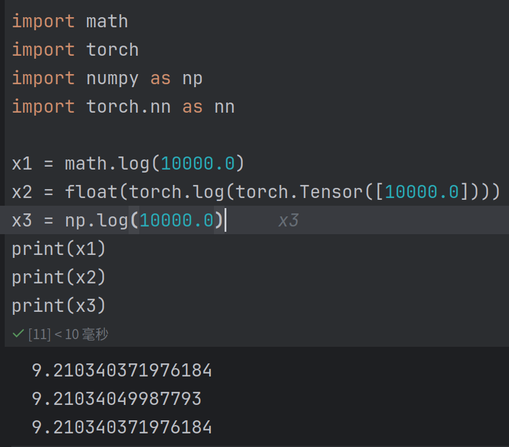

# 使用方法

1. 开始使用这个项目时，先尝试运行放在```./nlp-tutorial/5-1.Transformer```文件夹里的文件(.py或者notebook都可以)
   ，跑出来的数据无所谓，可以把batch改小一点，重点在于确认pytorch和cuda环境安装正确。这里面借鉴的资料来源如下：
    - 目录中的```main.py```来自B站up [deep_thoughts](https://space.bilibili.com/373596439)
      关于 transformer 的 [Encoder](https://www.bilibili.com/video/BV1cP4y1V7GF)
      和 [Decoder](https://www.bilibili.com/video/BV1Qg411N74v)的视频。刚开始学习 transformer
      的同志们可以先简单了解该模型的结构之后跟着视频把这些重难点了解一下。有了切身的体会之后就可以更好地理解模型的原理了。
    - 目录```./nlp-tutorial```来自GitHub上的同名库[nlp-tutorial](https://github.com/wmathor/nlp-tutorial)
      。这里面有很多经典模型和算法的代码，应该都是可以开箱即用的。
2. ```my_transformer```是现在主要进行的工作。我想参考着项目里的代码手敲一遍transformer进行英文到中文的翻译（是的，语料库的文本就是Attention
   is All You Need的原文以及稍微修改过的机翻文本）
3. ```NoCudaVer.py```最开始和nlp-tutorial的原文的区别只是删去了所有的cuda相关的代码，这样没插电时也方便查看和调试。现在它上面也有我自己的注释和一些修改。
4. ```test.ipynb```正如其名，用于做一些简单的实验和展示
5. ```READE.md```里面包含我自用的笔记和todo-list，里面附带的阅读资料也是我在查阅时记录的。

### 目录（不包含nlp-tutorial,不一定及时更新）

```
├── assets
│ └── img.png
├── corpus
│ ├── train
│ │ ├── CN.txt
│ │ └── EN.txt
│ └── valid
├── main.py
├── my_transformer.ipynb
├── NoCudaVer.py
├── README.md
└── test.ipynb
```

# 知识点

- [x] 查看```nn.model```的文档
    - [官方文档](https://pytorch.org/docs/stable/generated/torch.nn.Module.html)
- [x] ```optim.SGD(..., momentum=0.99)```后一个参数怎么理解
    - 回答：是一个用于加速 SGD 收敛的参数。它引入了上一步梯度的指数加权平均。通常设置在 0 到 1 之间。当 momentum 大于 0
      时，算法在更新时会考虑之前的梯度，有助于加速收敛。
        - SGD、Momentum、RMSProp、Adam的[介绍](https://zhuanlan.zhihu.com/p/78622301)
- [x] ```dataloader```的参数的含义
    - 对应的资料已经加到书签栏里了
    - 来自知乎的文章：[Dataset](https://zhuanlan.zhihu.com/p/105507334)
      和 [DataLoader](https://zhuanlan.zhihu.com/p/105578087)
    - [官方文档](https://pytorch.org/tutorials/beginner/basics/data_tutorial.html)
- [x] 查看```make_data()```的返回值的内容
- [x] ```LongTensor```的作用
    - 回答：```make_data```是要返回序列下标作为embedding的输入的。理由因此也是显而易见的。
- [x] ```position_encoding```的```forward```
    - 提交了position_encoding的实验，不明白了可以运行看看。
- [ ] 根据这里的代码中的dec_inputs和dec_outputs,是否就是资料中所提到的teacher forcing?
- [ ] ```model(enc_inputs, dec_inputs)```为什么可以不调用```forward```?
- [x] 在这个代码示例里面，word embedding是不包含语义信息的吗？
    - 回答：是的。在提交的```word embedding```实验中可以观察到每一次的embedding都是随机生成的
- [ ] MHA的residual为何使用的是input_Q?有空应当完整的检查一下代码看看是否有区别。

# 运行

- [x] 多次运行该代码会改变结果吗？
    - 回答：是的。根据参数不变，运行两次时得到的loss并不一致就可以的出这个结论。
- [ ] 与原论文相比似乎还有label smoothing没有实现
- [ ] ```batch_size```应当作为一个变量重构。(问题最初来自于```DataLoader```)
- [ ] ```register_buffer()```能否删除->cuda版也可以试一试
- [ ] ```Linear```设置为```bias=False```对训练会有什么影响？似乎可以记录loss来进行实验

# 笔记

- 这里有一个实现的技巧在于：src和tgt vocab都把padding对应了0,从而与其中对应的代码结合。而与之相对应的，开始标记S与中止标记E的索引则无关紧要。
- 偶然发现的事情：```torch.log```可能不等于```math.log```
    - 如图所示：
