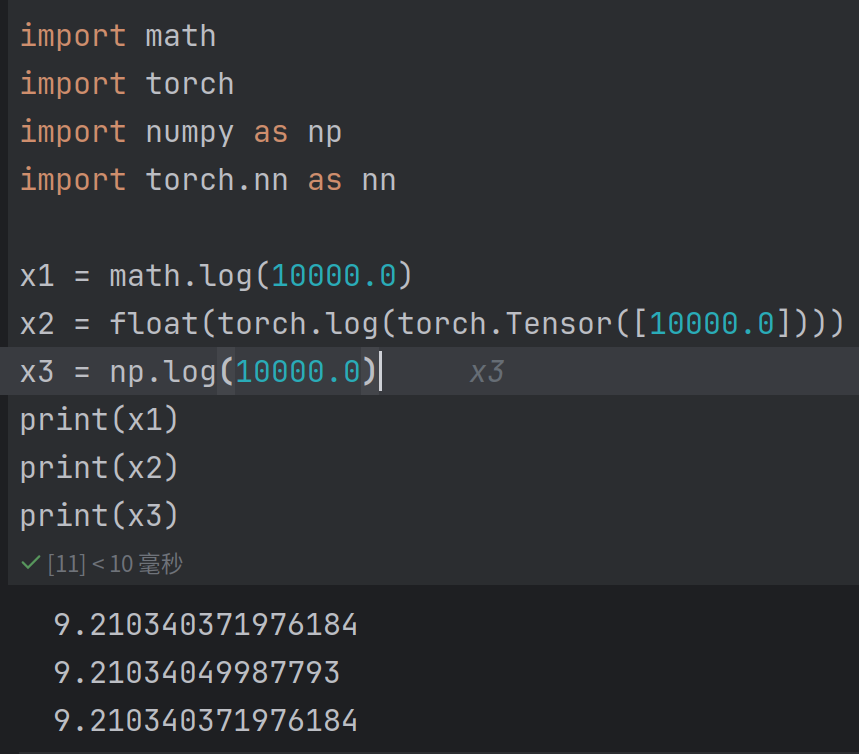

# 知识点

- [x] 查看```nn.model```的文档
- [x] ```optim.SGD(..., momentum=0.99)```后一个参数怎么理解
    - 回答：是一个用于加速 SGD 收敛的参数。它引入了上一步梯度的指数加权平均。通常设置在 0 到 1 之间。当 momentum 大于 0
      时，算法在更新时会考虑之前的梯度，有助于加速收敛。
- [x] ```dataloader```的参数的含义
    - 对应的资料已经加到书签栏里了
- [ ] ```LongTensor```的作用
- [ ] ```position_encoding```的```forward```
- [ ] 根据这里的代码中的dec_inputs和dec_outputs,是否就是资料中所提到的teacher forcing?
- [ ] ```model(enc_inputs, dec_inputs)```为什么可以不调用```forward```?
- [x] 在这个代码示例里面，word embedding是不包含语义信息的吗？
    - 回答：是的。在提交的```word embedding```实验中可以观察到每一次的embedding都是随机生成的
- [ ] torch中的DataSet库
- [ ] MHA的residual为何使用的是input_Q?有空应当完整的检查一下代码看看是否有区别。
- [ ] 收藏夹里还有LayerNorm和WarmUp的阅读资料没有看

# 运行

- [x] 多次运行该代码会改变结果吗？
    - 回答：是的。根据参数不变，运行两次时得到的loss并不一致就可以的出这个结论。
- [ ] ```batch_size```应当作为一个变量重构。(问题来自于```DataLoader```)
- [ ] ```register_buffer()```
- [ ] 查看```make_data()```的返回值的形状
- [ ] 尝试修改代码，计算训练时的perplexity
- [ ] ```MyDataSet```相关的代码可以优化(?)
- [ ] ```Linear```设置为```bias=False```对训练会有什么影响？似乎可以记录loss来进行实验
- [ ] 自己实现一个tokenizer?

# 笔记

- 这里有一个实现的技巧在于：src和tgt vocab都把padding对应了0,从而与其中对应的代码结合。而与之相对应的，开始标记S与中止标记E的索引则无关紧要。
- 偶然发现的事情：```torch.log```可能不完全等于```math.log```
    - 如图所示：
